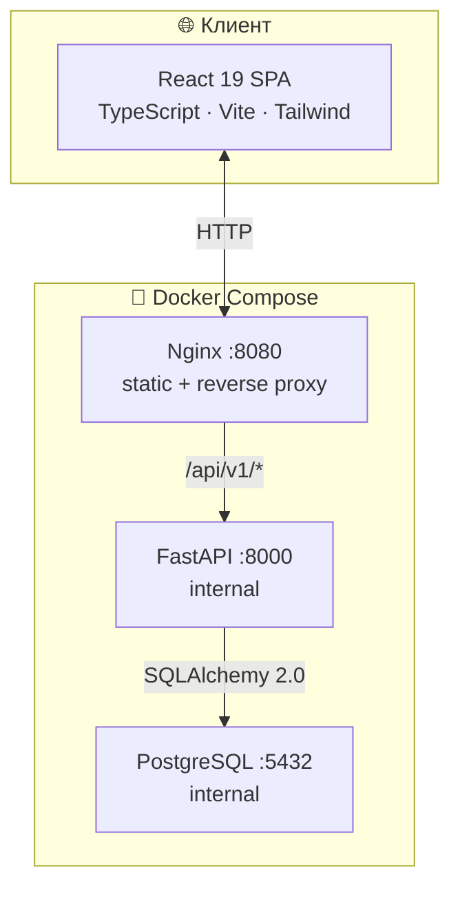

<div align="center">


<br>

[](https://react.dev)
[](https://typescriptlang.org)
[](https://fastapi.tiangolo.com)
[](https://postgresql.org)
[](https://docs.docker.com/compose)
[]()
[]()

</div>

---

Учебный full-stack проект — трекер личных финансов, написанный с нуля. Мульти-счета, аналитика с прогнозом методом Монте-Карло, копилки с начислением процентов, геймификация (стрики · достижения · XP). Полный стек: React + FastAPI + PostgreSQL, деплой через Docker Compose с Nginx.

---

## Возможности

<table>
<tr>
<td width="50%" valign="top">

**💳 Счета и транзакции**
- Наличные, карты, накопительные счета
- Доходы, расходы, переводы
- 50+ системных категорий + пользовательские
- Переводы между счетами — атомарные через `SELECT FOR UPDATE`

</td>
<td width="50%" valign="top">

**📊 Аналитика**
- Расходы по категориям и трендам по месяцам
- Прогноз баланса на 7 / 30 дней методом Монте-Карло
- In-process TTL-кеш (300 с) с инвалидацией по `user_id`

</td>
</tr>
<tr>
<td width="50%" valign="top">

**🎯 Цели накоплений**
- Копилка с суммой, датой и прогресс-баром
- Начисление процентов
- Каждый депозит создаёт `expense`-транзакцию → аналитика всегда синхронна

</td>
<td width="50%" valign="top">

**🏆 Геймификация**
- Ежедневный стрик + XP-система
- 22 достижения · 4 уровня редкости
- Вся логика на бэкенде — нет drift'а клиента

</td>
</tr>
<tr>
<td width="50%" valign="top">

**🔐 Безопасность**
- JWT: access token в React state, refresh в `httpOnly` cookie
- Rate limiting (slowapi), логирование событий безопасности
- Сброс пароля через email (Resend API)

</td>
<td width="50%" valign="top">

**🌍 Локализация и UX**
- Интерфейс на русском и английском (LangContext)
- Framer Motion анимации · Radix UI компоненты
- 60+ переиспользуемых UI-компонентов

</td>
</tr>
</table>

---

## Стек

<div align="center">

<table>
<tr>
<th align="center">Frontend</th>
<th align="center">Backend</th>
<th align="center">Инфраструктура</th>
</tr>
<tr>
<td align="center" valign="top">
&nbsp;&nbsp;
&nbsp;&nbsp;

<br><sub>React 19 · TypeScript 5.9 · Vite 7</sub>
<br><sub>Tailwind CSS · Radix UI · Framer Motion</sub>
<br><sub>React Router 7 · React Hook Form · Zod · Recharts</sub>
</td>
<td align="center" valign="top">
&nbsp;&nbsp;
&nbsp;&nbsp;

<br><sub>FastAPI 0.116 · SQLAlchemy 2.0 · Alembic</sub>
<br><sub>PostgreSQL 16 · psycopg3</sub>
<br><sub>python-jose · passlib[bcrypt] · slowapi</sub>
</td>
<td align="center" valign="top">
&nbsp;&nbsp;
&nbsp;&nbsp;

<br><sub>Docker Compose · Nginx</sub>
<br><sub>pytest · 154 теста</sub>
<br><sub>Alembic · 22 миграции</sub>
</td>
</tr>
</table>

</div>

---

## Архитектура



Три контейнера. Backend и БД не пробрасывают порты наружу — доступны только через Nginx-прокси. Каждый контейнер с healthcheck.

```
app/src/
├── pages/          # 13 страниц-маршрутов
├── context/        # AuthContext · TransactionsContext · LangContext
├── lib/api.ts      # Все API-вызовы, Bearer-заголовок, авто-logout при 401
└── components/ui/  # 60+ Radix-based UI-компонентов

backend/app/
├── auth/           # JWT, bcrypt, refresh tokens, password reset
├── accounts/       # Счета и переводы (SELECT FOR UPDATE)
├── savings/        # Цели, депозиты, начисление процентов
├── gamification/   # Стрики, 22 достижения, XP
├── analytics/      # Метрики, тренды, прогноз Монте-Карло
└── api/routes/     # REST-эндпоинты
```

---

## Технические решения

| Задача | Решение | Зачем |
|---|---|---|
| Денежные значения | `NUMERIC(14,2)` в БД, `Decimal` в Python — никогда `float` | Исключить ошибки округления |
| Переводы | `SELECT FOR UPDATE` на оба счёта внутри одной транзакции | Атомарность при конкурентных запросах |
| Токены | Access в React state, refresh в `httpOnly` cookie | XSS не достаёт до refresh token |
| Баланс | Вычисляется из транзакций, не хранится в БД | Нет рассинхронизации при откате операций |
| Депозиты | Каждый депозит → `expense`-транзакция в `invest-savings` | Аналитика и история всегда синхронны |
| Категории | Системные — Alembic-миграции, кастомные — API | Одинаковый seed во всех окружениях |
| Кеш аналитики | In-process TTL-кеш (300 с) с инвалидацией по `user_id` | Меньше SQL при повторных запросах |
| Геймификация | Стрики и достижения считаются на бэкенде | Единый источник правды, нет drift'а клиента |

---

## Масштаб проекта

<div align="center">

| 154 теста | 22 миграции | 22 достижения | 50+ категорий | 13 страниц | 60+ компонентов |
|:---:|:---:|:---:|:---:|:---:|:---:|

</div>

---

<details>
<summary><strong>Запуск локально</strong></summary>

```bash
git clone https://github.com/LTYcsv/app_Budget.git
cd app_Budget
cp backend/.env.example backend/.env
# заполнить DB_PASSWORD и JWT_SECRET_KEY в backend/.env
docker compose up -d --build
# → http://localhost:8080
```

```env
# backend/.env (минимум)
DB_PASSWORD=your_password
JWT_SECRET_KEY=...   # python -c "import secrets; print(secrets.token_hex(32))"
COOKIE_SECURE=false
```

</details>

---

## Лицензия

© 2025 LTYcsv. Все права защищены.

Исходный код опубликован в ознакомительных целях. Использование, копирование, распространение или развёртывание без письменного разрешения автора запрещено.
